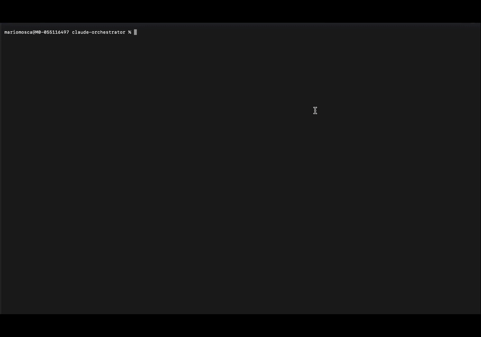

# Claude Orchestrator

**Multi-project task orchestrator with TUI, powered by Claude Agent SDK.**

[](https://opensource.org/licenses/MIT)
[](https://www.typescriptlang.org/)
[](https://docs.anthropic.com/en/docs/agents-and-tools/claude-code/overview)
[](https://github.com/vadimdemedes/ink)

---

## Overview

Claude Orchestrator runs multiple AI-powered tasks across different projects from a single terminal interface. Define tasks in YAML, let the DAG resolver handle dependencies, and watch Claude execute them in parallel.

**Define. Review. Execute. Monitor.**

---

## Features

| Feature | Description |
|---------|-------------|
| **YAML Task Batches** | Define tasks with dependencies, budgets, and tool permissions |
| **DAG Resolution** | Automatic dependency resolution with topological sorting |
| **Parallel Execution** | Run multiple tasks concurrently (configurable limit) |
| **Plan Mode** | AI pre-analysis before execution — review what each task will do |
| **TUI Dashboard** | Real-time monitoring with keyboard navigation |
| **Escalation Flow** | Agent asks for human input when uncertain |
| **Project Context** | Auto-loads CLAUDE.md and project settings |
| **State Persistence** | Resume interrupted batches from saved state |
| **Cost Analytics** | Track spending per task and project |

---

## TUI Preview



---

## How It Works

```
┌─────────────────────────────────────────────────────────────────┐
│                     Claude Orchestrator                          │
├─────────────────────────────────────────────────────────────────┤
│                                                                 │
│   1. Load YAML task file                                        │
│              ↓                                                  │
│   2. Parse & validate (dependencies, budgets, tools)            │
│              ↓                                                  │
│   3. DAG analysis → execution levels                            │
│              ↓                                                  │
│   4. [Plan Mode] AI analyzes each task                          │
│              ↓                                                  │
│   5. User reviews & approves                                    │
│              ↓                                                  │
│   6. Queue manager executes (parallel where possible)           │
│              ↓                                                  │
│   7. Real-time TUI updates                                      │
│              ↓                                                  │
│   8. Results saved to state/logs                                │
│                                                                 │
└─────────────────────────────────────────────────────────────────┘
```

---

## Quick Start

### Prerequisites

- Node.js 18+
- [Claude Code CLI](https://docs.anthropic.com/en/docs/agents-and-tools/claude-code/overview) installed and authenticated

### Installation

```bash
# Clone
git clone https://github.com/mariomosca/claude-orchestrator.git
cd claude-orchestrator

# Install dependencies
npm install

# Build
npm run build

# Link globally (optional)
npm link
```

### Create a Task File

```yaml
# tasks/morning-sprint.yaml
name: "Morning Sprint"
maxConcurrent: 3
defaultBudget: 3.00
defaultTools: [Read, Edit, Glob, Grep]

tasks:
  - id: fix-auth-bug
    project: my-app
    cwd: ~/Projects/my-app
    prompt: |
      Fix the authentication timeout bug in /api/auth/refresh.
      The token refresh fails after 30 minutes.
    tools: [Read, Edit, Bash]
    budget: 3.00

  - id: update-error-ui
    project: my-app
    cwd: ~/Projects/my-app
    prompt: |
      Update the error UI to show a friendly message
      when refresh token expires.
    dependsOn: [fix-auth-bug]
    budget: 2.00

  - id: add-pdf-export
    project: other-app
    cwd: ~/Projects/other-app
    prompt: |
      Add PDF export feature using jsPDF library.
    tools: [Read, Edit, Write, Bash]
    budget: 5.00
```

### Run

```bash
# Run with TUI (includes Plan Mode)
claude-orchestrator run tasks/morning-sprint.yaml --tui

# Skip Plan Mode, execute immediately
claude-orchestrator run tasks/morning-sprint.yaml --tui --skip-plan

# Validate without executing
claude-orchestrator validate tasks/morning-sprint.yaml

# Resume interrupted batch
claude-orchestrator resume state/2026-01-31-morning-sprint.state.json
```

---

## CLI Commands

| Command | Description |
|---------|-------------|
| `run <yaml>` | Run a task batch |
| `resume <state>` | Resume interrupted batch |
| `validate <yaml>` | Validate YAML and show DAG |
| `status <state>` | Show batch status |
| `results <state>` | Show task results |
| `report <state>` | Generate AI summary report |

### Options

| Option | Description |
|--------|-------------|
| `--tui` | Use terminal UI with Plan Mode |
| `--skip-plan` | Skip Plan Mode, execute immediately |
| `--max-concurrent <n>` | Override max concurrent tasks |
| `--dry-run` | Parse and validate only |

---

## Keyboard Shortcuts

### Plan Mode

| Key | Action |
|-----|--------|
| `↑/↓` | Navigate tasks |
| `Enter` | Expand/collapse task details |
| `X` / `Space` | Toggle task inclusion |
| `A` | Approve and start execution |
| `Q` | Cancel and exit |

### Execution Mode

| Key | Action |
|-----|--------|
| `Tab` | Switch between panes |
| `Space` | Pause/Resume execution |
| `Enter` | Show task details |
| `L` | Open full log viewer |
| `S` | Show cost statistics |
| `R` | Retry failed task |
| `C` | Cancel running task |
| `Q` | Quit |

---

## YAML Schema

```yaml
name: string              # Batch name
maxConcurrent: number     # Max parallel tasks (default: 3)
defaultBudget: number     # Default cost limit per task
defaultTools: string[]    # Default allowed tools
globalInstructions: |     # Instructions for all tasks
  Additional context...

tasks:
  - id: string            # Unique task ID
    project: string       # Project name (for grouping)
    cwd: string           # Working directory (~ expanded)
    prompt: string        # Task prompt for Claude
    model: string         # haiku | sonnet | opus (default: sonnet)
    tools: string[]       # Allowed tools (overrides default)
    budget: number        # Cost limit (overrides default)
    dependsOn: string[]   # Task IDs that must complete first
    instructions: string  # Task-specific instructions
```

---

## Project Structure

```
claude-orchestrator/
├── src/
│   ├── cli.ts              # CLI entry point
│   ├── App.tsx             # TUI application
│   ├── components/         # Ink React components
│   │   ├── Dashboard.tsx   # Main execution view
│   │   ├── PlanningPane.tsx # Plan Mode view
│   │   ├── LogViewerPane.tsx # Full log viewer
│   │   ├── StatsPane.tsx   # Cost analytics
│   │   └── ...
│   ├── engine/             # Core logic
│   │   ├── parser.ts       # YAML parsing
│   │   ├── dag.ts          # Dependency resolution
│   │   ├── queue.ts        # Execution manager
│   │   ├── runner.ts       # Claude SDK wrapper
│   │   ├── state.ts        # Persistence
│   │   ├── context.ts      # Project context
│   │   └── analyzer.ts     # AI pre-analysis
│   └── types/              # TypeScript interfaces
├── tasks/                  # Task YAML files
├── state/                  # Saved batch states
├── logs/                   # Execution logs
└── docs/                   # Documentation
```

---

## State & Logs

Batch execution is automatically saved:

```
state/
└── 2026-01-31-morning-sprint-a1b2.state.json

logs/
└── 2026-01-31-morning-sprint-a1b2/
    ├── fix-auth-bug.log
    ├── fix-auth-bug.result.json
    ├── update-error-ui.log
    └── ...
```

Resume any interrupted batch:

```bash
claude-orchestrator resume state/2026-01-31-morning-sprint-a1b2.state.json
```

---

## Escalation Flow

When Claude is uncertain, it escalates to you:

```
┌─────────────────────────────────────────────────────────────────┐
│  ⚠️  ESCALATION from: fix-auth-bug                              │
├─────────────────────────────────────────────────────────────────┤
│                                                                 │
│  The existing auth logic uses both JWT and session cookies.     │
│  Which approach should I use for the fix?                       │
│                                                                 │
│  [1] JWT only (recommended)                                     │
│  [2] Session cookies only                                       │
│  [3] Keep hybrid approach                                       │
│                                                                 │
│  Press 1-3 to select, or T for custom text response             │
└─────────────────────────────────────────────────────────────────┘
```

---

## Agent Guardrails

Every task includes built-in safety instructions:

1. **No Regressions** — Run tests before and after changes
2. **Study First** — Read files before modifying
3. **Ask if Uncertain** — Escalate ambiguous prompts
4. **Minimal Scope** — Only do what's requested
5. **Transparency** — Explain actions before taking them

---

## Cost Analytics

Press `S` to view detailed cost breakdown:

```
┌─────────────────────────────────────────────────────────────────┐
│  Cost Analytics: Morning Sprint                                 │
├─────────────────────────────────────────────────────────────────┤
│  Total Cost:      $2.45                                         │
│  Avg Cost/Task:   $0.35                                         │
│  Cost/Minute:     $0.12                                         │
│  Elapsed Time:    20m 15s                                       │
├─────────────────────────────────────────────────────────────────┤
│  Cost by Project                                                │
│  ─────────────────────────────────────────────────────          │
│  my-app           3/3      $1.80    $0.60/task                  │
│  other-app        1/1      $0.65    $0.65/task                  │
├─────────────────────────────────────────────────────────────────┤
│  Top 5 Most Expensive Tasks                                     │
│  ─────────────────────────────────────────────────────          │
│  add-pdf-export              $0.65                              │
│  fix-auth-bug                $0.58                              │
│  update-error-ui             $0.57                              │
└─────────────────────────────────────────────────────────────────┘
```

---

## Dependencies

| Package | Purpose |
|---------|---------|
| `@anthropic-ai/claude-agent-sdk` | Claude Code integration |
| `ink` | React-based terminal UI |
| `react` | Component framework |
| `yaml` | YAML parsing |

---

## Roadmap

- [x] **v0.1** — MVP with TUI and basic execution
- [x] **v0.2** — Escalation flow and project context
- [x] **v0.3** — Plan Mode with AI pre-analysis
- [x] **v0.4** — Polish (log viewer, stats, error handling)
- [ ] **v1.0** — Production ready (tests, full docs)
- [ ] **v2.0** — Notifications, scheduling, cloud sync

---

## Related Projects

- [Ralph](https://github.com/mariomosca/ralph) — Autonomous Claude agent in Docker
- [Claude Code](https://docs.anthropic.com/en/docs/agents-and-tools/claude-code/overview) — The underlying CLI

---

## License

MIT License — see [LICENSE](LICENSE) for details.

---

## Contributing

Contributions welcome! Please:

1. Fork the repository
2. Create a feature branch
3. Add tests for new functionality
4. Submit a pull request

---

[](https://claude.ai)
